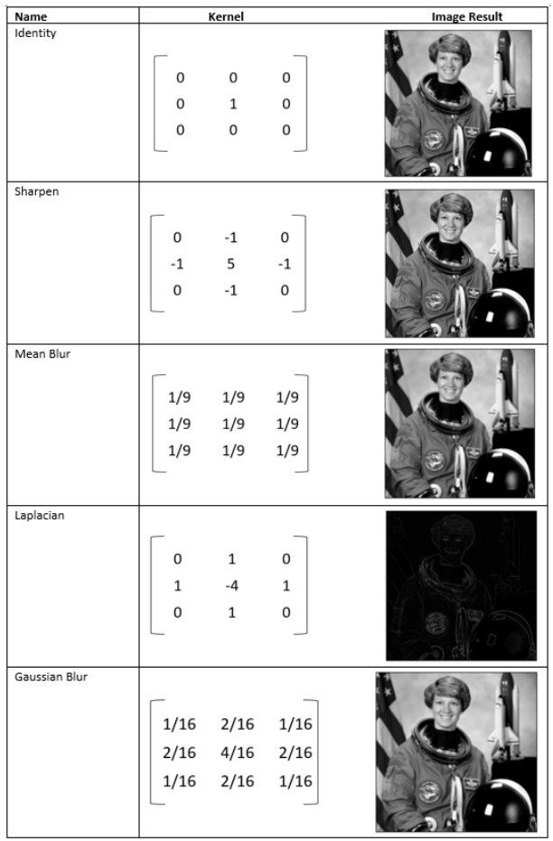
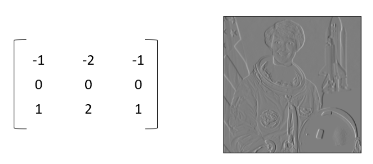
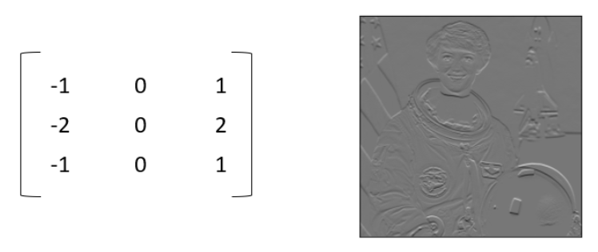

# Convolution Filters | `Kernels`

Used with images for `blurring`, `sharpening`, `embossing`, `edge detection` and more.

`Kernels` are typically `3 x 3` matrices.

`Kernels` move over an image from `top left` to `bottom right` and process for all the pixels in the image.

`Corner` edge pixels of image is also included by using `extending`, `wrapping`, `mirroring` and `cropping`

Depending on filter values (Kernel), convolution can have a variety of effects.

### `Sobel` Filters

`Sobel` filters are best for detecting edges in an image (Especially for chessboard, bricks, etc)

`Horizontal` kernel :

`Vertical` kernel :

